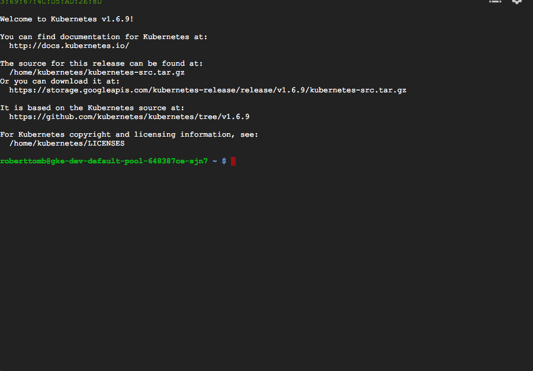

# here i am doing some terraform and gcp

I started with a great tutorial from [elasticbyte](https://blog.elasticbyte.net/getting-started-with-terraform-and-google-compute-engine/), but I struggled with "success" using their tutorial. Namely, I tripped over the firewall and did not get the example running.

After slamming through a few more searches for `terraform gcp tutorial`, I
landed on [Using Terraform to Bootstrap a Google Cloud Platform
Cluster](https://mrooding.me/using-terraform-to-bootstrap-a-google-cloud-platform-cluster-fb709d13f6f9).
This repo is my implementation (theft) of [Ramblings of a Dutch
Dev](https://mrooding.me/)'s hard work, so I am not going to rewrite what he's
done, but I will add a few things I learned along the way. 

## some missing steps

1. install terraform
1. set up gcp commandline tools, which failed due to my python
1. had to `brew install zlib`
1. then `brew upgrade python`
1. then gcp installed and ran
1. get google credential.json file downloaded (Marc Rooding covered this, but it
   **was not** in the elasticbyte tutorial.
1. `gcloud init`
1. terraform init
1. enable google compute API 
1. enable google Container Engine API 

## success

